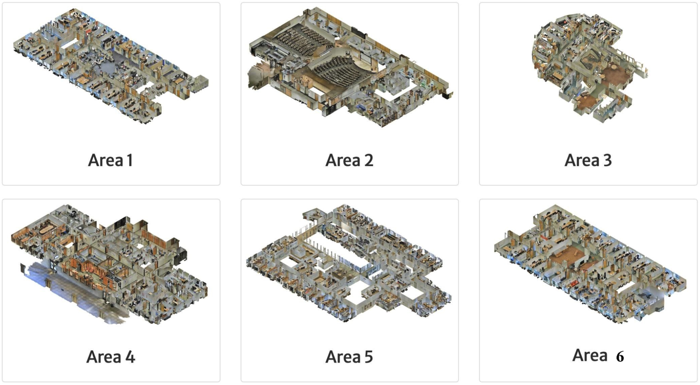

This is code for processing the [S3DIS](http://buildingparser.stanford.edu/images/3D_Semantic_Parsing.pdf) (3D Semantic Parsing of Large-Scale Indoor Spaces) dataset.


- 6 areas: Area_1, Area_2, Area_3, Area_4, Area_5 and Area_6
- 13 classes: Ceiling, Floor, Wall, Beam, Column, Window, Door, Table, Chair, Sofa, Bookcase, Board and CLutter
- 11 scenes: Office, Conference Room, Hallway, Auditorium, Open Space, Lobby, Lounge, Pantry, Copy Room, Storage and WC




Unzip Stanford3dDataset_v1.2_Aligned_Version.zip

```
|-- Area_1
|   |-- conferenceRoom_1: 
|   |   |-- Annotations
|   |   |   |-- beam_1.txt
|   |   |   |-- ...
|   |   |   |-- wall_4.txt
|   |   |
|   |   |-- conferenceRoom_1.txt
|   |
|   |-- ...
|   |-- pantry_1
|   |-- WC_1
|
|-- Area_2
|-- Area_3
|-- Area_4
|-- Area_5
|-- Area_6
```


## 1. Setup:
```
cd utils/cpp_wrappers
bash utils/cpp_wrappers/compile_wrappers.sh
```


The grid sampling method written in C++ code needs to be packaged into a Python library.
The grid_subsampling package is installed in the utils/cpp_wrappers/cpp_subsampling folder.

## 2. Generate the processed files

```
python prepare_S3DIS.py
```

(1) Aggregate all the points in the room.  
(2) Reduce the number of points using grid sampling method.  
(3) Generate the KDTrees.  
(4) Record the index of each point.  


## 3. Visualize the point clouds using Open3D.

```
python draw.py
```
